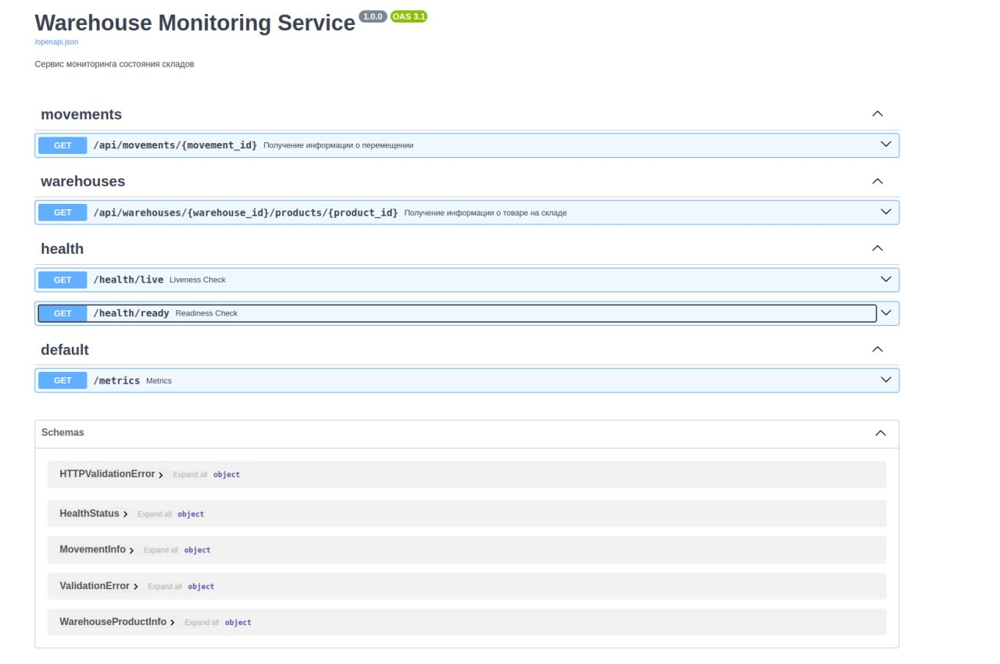

# Сервис мониторинга состояния складов

Микросервис на Python 3.11 для обработки сообщений от складов о приемке и отправке товаров.

## Функциональность

- Обработка сообщений из Kafka о перемещениях товаров между складами
- Сохранение информации о перемещениях в базе данных
- Предоставление API для получения информации о перемещениях и текущем состоянии складов
- Кеширование данных для повышения производительности
- Мониторинг с метриками Prometheus
- Проверки здоровья (health checks) для liveness и readiness проб

## Технологии

- Python 3.11
- FastAPI - для API
- Kafka - для обработки сообщений
- PostgreSQL - для хранения данных
- Docker и Docker Compose - для контейнеризации
- ~~Prometheus - для сбора метрик~~
- ~~Grafana - для визуализации метрик~~

## Установка и запуск

### С использованием Docker Compose

```bash
# Клонировать репозиторий
git clone <repository-url>
cd warehouse

# Запустить все сервисы
docker-compose up -d

# Остановить все сервисы
docker-compose down
```

# Сваггер



## Проверка "боем"

После запуска можно протестировать работу с помощью скриптов из папки `kafka_requests`:

- `send_arrival.py` - отправляет сообщение о прибытии товаров на склад
- `send_departure.py` - отправляет сообщение об отбытии товаров со склада

Запускайте эти скрипты можно сколько угодно раз для демонстрации работы:

```bash
python kafka_requests/send_arrival.py
python kafka_requests/send_departure.py
```

Принцип работы:
1. Скрипты отправляют сообщения в Kafka
2. API-сервис получает эти сообщения
3. Сервис обрабатывает данные и создает записи в базе данных

## Дополнительно

Дополнительно можно было бы прикрутить Redis для кеша, а также полноценно Grafana и Prometheus, но посчитал что того, что реализовал, достаточно.
